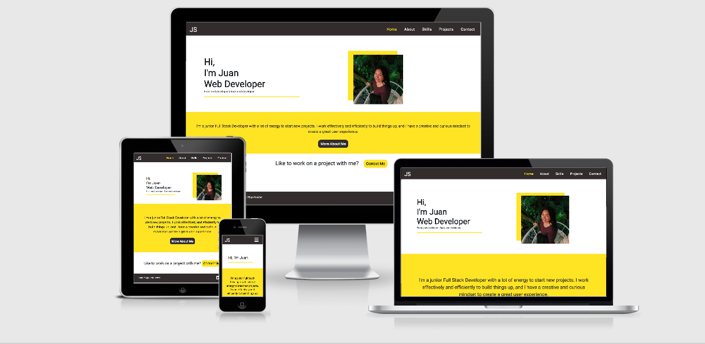

<h1 align="center">Portfolio website | Juan Stelling</h1>

This website presents my portfolio website, to present myself as a web developer. 
I wanted a portfolio website for a while but never started it. This project was a good opportunity to create my portfolio website with a self-written code, to show my skills. 
The website shows my resume, where you get to know me more. The website provides information about my skills, education and personal information. 

This project is the first of four Milestone Projects in the Full Stack Web Development Program I am attending at The Code Institute. 

**[View the live project here.](https://juanstelling.github.io/MS1_portfolio_website/)**

---

## Index 

- <a href="#ux">1. User experience (UX)</a>
  - <a href="#ux-goals">1.1. Project goals</a>
  - <a href="#ux-stories">1.2 User stories</a>
  - <a href="#ux-design">1.3 Design</a>
  - <a href="#ux-wireframes">1.4 Wireframes</a>
- <a href="#features">2. Features</a>
  - <a href="#features-existing">2.1 Existing features</a>
  - <a href="#features-future">2.2 Features left to implement in the future</a>
- <a href="#technologies">3. Technologies used</a>
- <a href="#testing">4. Testing</a>
- <a href="#deployment">5. Deployment</a>
- <a href="#credits">6. Credits</a>

---

<h1>1. User experience (UX)</h1>

### 1.1 Project goals 

- Making a static front-end site to present useful information to users/ recruitments, using all technologies that I have learned about so far. (HTML, CSS, Bootstrap and user experience/design) 
- Creating a website that is easy to navigate and easy to understand. 
- The customer experience has to be great on every device and internet browser.
- I am creating a portfolio website to show my skills, experiences, creativity and competencies to present myself and to get hired. 
- The portfolio website is for recruiters and the tech industry, who want to know more about me.

### 1.2 User stories 

#### First time visitors goals 
1. As a first time visitor, I want  the website scales on every device, so that I can look at the website on desktop, mobile and tablet. 
2. As a first time visitor, I want to be able to navigate easily through the website. 
3. As a first time visitor, I want to know more about the person, so that I get a feeling by the person. 
4. As a first time visitor, I want to see the skills and education of the person, so that I know what the web developer can do.
5. As a first time visitor, I want to know which projects the person has done, so that I know the level of experience of the person. 

#### Returning visitors goals
1. As a returning visitor, I want to know how I can contact the person for potential projects/ more information so that I can reach out to that person. 
2. As a returning visitor, I want to find the social links of the person on the website so that I can see the socials of the person. 
3. As a returning visitor, I want to know more information about the projects the person has done so that I know the level of experience of the person. 

### 1.3 Design 

- #### Colour scheme 
The two main colours that are used are:
-  #fddf3f (Yellow)
-  #312c2c (Dark Gray)

I have chosen these colours because I already used these colours for my portfolio that I made in university. The yellow colour represents optimism and energy. Other terms I associate with yellow are wisdom growing. The dark gray colour is chosen because this is slightly softer than the colour black and with this colour, I wanted to create a contrast between a bright and dark colour. 

- #### Typography 
The Roboto font is the main font used throughout the whole portfolio website. Sans Serif is the fallback in case the main font isn’t being imported to the site correctly. Roboto is chosen for its clean and calm design. 

- #### Imagery
All images are personal images, to make a personal ambiance of the developer. With the imagery, it has been taken into account that the colours in the image match with the yellow colour of the website. The images are square (except for the project images) to make the website sleek.

### 1.4 Wireframes 
Instead of wireframes, I preferred to make mockups. I used mockups to fleshes out the static visual look of the site. The mockups are made with [Figma.](https://www.figma.com/)

Click on the links below to see the mockups in Figma.
|    Desktop   |    Tablet    |    Mobile    |
|    :----:    |     :----:   |    :----:    |
|[Home Page](https://www.figma.com/file/twjTYHuIbgD7nqcPA4EFf9/Milestone-project-1?node-id=0%3A1)|[All pages](https://www.figma.com/file/twjTYHuIbgD7nqcPA4EFf9/Milestone-project-1?node-id=6%3A28)|[All pages](https://www.figma.com/file/twjTYHuIbgD7nqcPA4EFf9/Milestone-project-1?node-id=6%3A27)|
|[About Page](https://www.figma.com/file/twjTYHuIbgD7nqcPA4EFf9/Milestone-project-1?node-id=1%3A3)|
|[Skills Page](https://www.figma.com/file/twjTYHuIbgD7nqcPA4EFf9/Milestone-project-1?node-id=1%3A4)|||
|[Project Page](https://www.figma.com/file/twjTYHuIbgD7nqcPA4EFf9/Milestone-project-1?node-id=20%3A62)|||
|[Contact Page](https://www.figma.com/file/twjTYHuIbgD7nqcPA4EFf9/Milestone-project-1?node-id=3%3A67)|||

<h1>2. Features</h1>

### 2.1 Existing features 

#### General 
- The website is fully responsive on every device and internet service. 
- The lay-out is sleek and simple, and every page has the same lay-out. 

#### Header 
- My personal logo is shown on the header on the left side.
- The navibar is shown on the right side of the header. With a mobile device, the navibar is displayed in a hamburger menu. 

#### Footer 
- Social media links of LinkedIn and the GitHub.  
- An inspirational Quote. 

#### Home
- The homepage has an introduction of myself
- The homepage has a picture of me.
- Call-to-action: from the homepage there are links to the about page and contact page. 

#### About 
- The about page has a section with text about business and personal information.
- The about page has five images next to each other, for the user to see who I am. 

#### Skill page 
- The skill page shows the skills (in web development) and history education (in two different sections) 
- The history education is displayed by a line with dots 

#### Project page 
- The project page contains six projects based on fiction.
- The projects are displayed as images, and when the mouse hovers over the images another block is displaying. 

#### Contact page 
- Has a contact form where the user can fill in contact information and a message. 
- The background colour of the boxes are light grey, and have a drop shadow. 
- Email address is included in text, so users can also reach out to me by mail. 

### 2.2 Features left to implement in the future 
- Taking the text: "Hi, I'm Juan Web Developer" moving. The letters are typed when you open the page.
- Making the projects on the project page more interactive, by letting them move a little more. 
- Visualize my software development skills (such as html, css, etc) with a dots on the skills page

<h1>3. Technologies used</h1>

#### Languages used
- [HTML5](https://en.wikipedia.org/wiki/HTML5)
    - HTML5 provides the structure and the content for my project. 
- [CSS3](https://en.wikipedia.org/wiki/Cascading_Style_Sheets)
    - CSS3 provides the style of the HTML5 elements.

#### Frameworks, libraries & programs used
-  [Bootstrap v4.5.2](https://getbootstrap.com/) 
    - Bootstrap v4.5.2 is used to create the layout for desktop and mobile.  
- [jQuery](https://jquery.com/) 
    - The jQuery is used in conjunction with the Bootstrap library. 
- [Gitpod](https://www.gitpod.io/) 
    - The GitPod is used to develop the project.
- [Git](https://git-scm.com/)
    - The Git was used for version control to commit to Git and push to GitHub.
- [GitHub](https://github.com/)
    - The GitHub is used to host the project.
- [Google Fonts](https://fonts.google.com/)
    - Google Fonts is used to provide the font roboto for all the text that is used in the project. 
- [Figma](https://www.figma.com/)
    - Figma is used to create the mockup designs for the project.

#### Testingtools used 
- [Autoprefixer](https://autoprefixer.github.io/)
    - Autoprefixer is used to parsethe CSS and to add vendor prefixes to CSS rules. 
- [W3C Markup Validation Service](https://validator.w3.org/)
    - The W3C MarkUp Validation Service is used to check whether there were any errors in the HTML5 code. 
- [W3C CSS validator](https://jigsaw.w3.org/css-validator/)
    - The W3C CSS validator is used to check whether there were any errors in the CSS3 code. 

<h1>4. Testing</h1>

The testing process can be found [here](TESTING.md).

<h1>5. Deployment</h1>

#### Deployment of my project 
This project is hosted in GitHub pages, to make my project visible to others. 

The project is deployed via the following steps:
1. Log in to GitHub and go to the repository.
2. At the top of the repository, locate the **Settings** button and click on it. 
3. On the Settings page, scroll down to the **GitHub Pages**  section.
4. Select **Master Branche** by the source section. 
5. The page refreshes automatically. 
6. Scroll down to the GitHub Page section and the link of the website is standing in the green bar.

#### Clone my project 
To make a local clone and deploy this project in your GitHub Desktop, follow the following steps. 

To clone this project from GitHub: 
1. Log in to GitHub and go to the repository. 
2. Click on the green button with the text **“Code”.**
3. Click on **“Open with GitHub Desktop”** and follow the prompts in the GitHub Desktop Application or follow the instructions from **[this link](https://docs.github.com/en/free-pro-team@latest/github/creating-cloning-and-archiving-repositories/cloning-a-repository#cloning-a-repository-to-github-desktop)** to see how to clone the repository in other ways. 

<h1>6. Credits</h1>

#### Content 
- All content on the website is created by the developer, Juan Stelling. 

#### Media 
- All images on the website are made by the developer, Juan Stelling. 

#### Acknowledgement 
Thanks to the following people or organizations who helped or inspired me for the project.  
- The support and guidance of my mentor Precious Ijege. 
- The lessons and knowledge of [Code Institute.](https://codeinstitute.net/)
- Inspiration for my portfolio website from the next people: [Seb Kay,](https://sebkay.com/) [Jacakjeznach](https://jacekjeznach.com/) and   [Matt Farley](https://mattfarley.ca/).
- The support of my fellow students, especially [Fernandagil,](https://github.com/fernandagil/ms1-nonnapepita-restaurant) from who I took inspiration for my README file. 