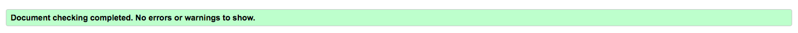
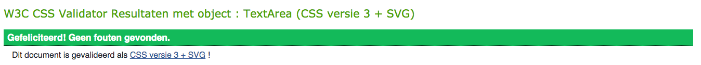
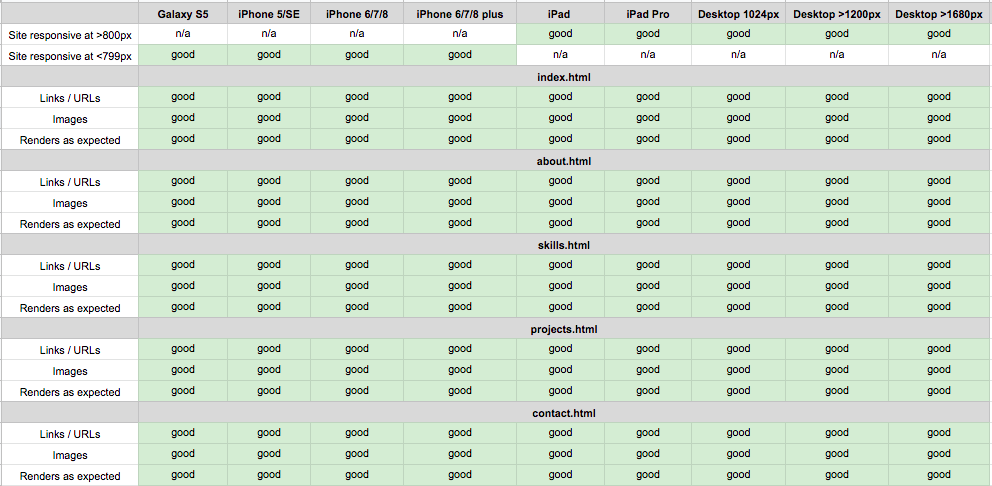
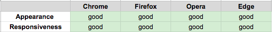

<h1 align="center">Testing</h1>

## Code validators

**[HTML Validator](https://validator.w3.org/):** No errors or warnings to show.

- Home Page

- About Page

- Skills Page 

- Projects Page 

- Contact Page

**[CSS Validator](https://jigsaw.w3.org/css-validator/):** No errors found.

## Responsiveness

- I tested the responsiveness of the website with [Chrome DevTools](https://developers.google.com/web/tools/chrome-devtools) and [Responsive Design Checker](https://www.responsivedesignchecker.com/).
- I tested the website on the following devices
    - Desktop (1024px, >1200px, >1680px)  
    - Galaxy S5
    - iPhone 5/SE
    - iPhone 6/7/8
    - iPhone 6/7/8 plus
    - iPhone X
    - iPad
    - iPad Pro

#### Notes 
- The portfolio website is designed to see the content at a glance. I designed the pages, so the user doesn't have to scroll down a page too much. The problem with this is that there is a lot of white space at the bottom of the pages with the iPad, iPad Pro and devices with a large width. This solved the problem as much as possible by making blocks longer, which reduces white space.

## Browser compatibility 

####  Notes 
- The Favicon (the logo next to the title) doesn't work on Microsoft Edge, opera and Firefox.

## Testing user stories 

#### First time visitors goals 
1. As a first time visitor, I want  the website scales on every device, so that I can look at the website on desktop, mobile and tablet.
    - The first time visitor can visite to the website on a computer, laptop, phone and tablet.
2. As a first time visitor, I want to be able to navigate easily through the website. 
    - The first time visitor sees the navigation on the top of the website (the header) where the visitor can easily navigate through the website. For the mobile visitors there is a hamburger menu. If the visitor clicks on the menu there is a dropdown with all the pages where the visitor can click in. 
3. As a first time visitor, I want to know more about the person, so that I get a feeling by the person. 
    - The first time visitor get to know the person because on the website there is information about the person about the characteristics, the skills, personal interests, the education about the person. There are also some personal images of the person on the website, the visitor can see the dog of the person and how the person looks like.
4. As a first time visitor, I want to see the skills and education of the person, so that I know what the web developer can do.
    - The first time visitor can go to the skills page where the visitor can read more about the skills of web development and the education history. 
5. As a first time visitor, I want to know which projects the person has done, so that I know the level of experience of the person. 
 - The first time visitor can go to the projects page where the visitor can see all projects the person has done. The projects for now are fictional because the person just started with development and hasn't any web development projects yet. 

#### Returning visitors goals
1. As a returning visitor, I want to know how I can contact the person for potential projects/ more information so that I can reach out to that person. 
    - The returning visitor can go to the contact page where the visitor can fill in a form to contact the person. On the contact page is also standing the email of the person, so the visitor can email the person. 
2. As a returning visitor, I want to find the social links of the person on the website so that I can see the socials of the person. 
    - The retuning visitor can find the social links at the bottom of the website (in the footer). The social links that are shared are LinkedIn and the GitHub. 
3. As a returning visitor, I want to know more information about the projects the person has done so that I know the level of experience of the person. 
    - The returning visitor can go to the projects page to see all projects of the person. If the visitor hovers over the projects there will be more information about the projects. The visitor can also visit the website of the project. This is also fictional. If the visitor clicks in the link, nothing will happen because the projects are not linked to real projects. 

## Bugs 

- respond of the hamburger menu 
- footer fixed 
- overflowing jumbotrons and containers 
- responsiveness on ipad and ipad pro 
